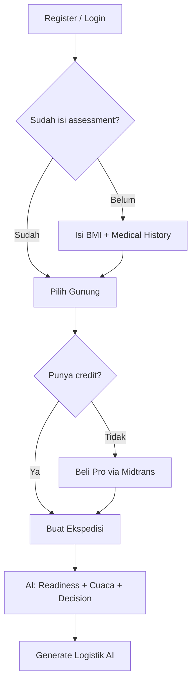

# KakiDaki Backend

Backend untuk **KakiDaki** — platform persiapan pendakian gunung berbasis AI. Dibangun dengan **NestJS**, **Prisma ORM** (PostgreSQL), dan terintegrasi dengan **Gemini AI**, **Open-Meteo**, **Strava**, dan **Midtrans (sandbox)**.

## Fitur Utama

- **Auth JWT** — register & login.
- **Assessment wajib** — BMI (tb/bb) + riwayat medis harus diisi sebelum boleh menyusun pendakian.
- **Personalisasi kemampuan** — manual atau otomatis dari Strava (capability score).
- **AI Readiness** — Gemini menghitung readiness score, keputusan Go / Caution / No-Go, dan rasional.
- **Saran logistik AI** — packing list otomatis, item wajib ditandai AI.
- **Cuaca** — prakiraan Open-Meteo untuk tanggal pendakian.
- **Strava sync** — tarik aktivitas latihan jadi training logs.
- **Komentar** — review gunung dengan upvote/downvote.
- **Pro credits** — free 1x persiapan, beli kredit lewat Midtrans untuk persiapan berikutnya.

## Tech Stack

| Komponen | Teknologi |
|----------|-----------|
| Framework | NestJS 10 |
| ORM | Prisma 6 (PostgreSQL) |
| Auth | JWT (Passport) |
| AI | Google Gemini API |
| Cuaca | Open-Meteo API |
| Fitness | Strava OAuth API |
| Pembayaran | Midtrans Snap (sandbox) |
| Dokumentasi | Swagger / OpenAPI |

## Setup

### 1. Prasyarat
- Node.js 18+
- PostgreSQL 14+

### 2. Install
```bash
npm install
```

### 3. Environment
```bash
cp .env.example .env
# lalu isi kredensial: DATABASE_URL, JWT_SECRET, GEMINI_API_KEY,
# STRAVA_CLIENT_ID/SECRET, MIDTRANS_SERVER_KEY/CLIENT_KEY
```

### 4. Database
```bash
npm run prisma:generate
npm run prisma:migrate      # buat & terapkan migrasi
npm run prisma:seed         # isi data gunung contoh
```

### 5. Jalankan
```bash
npm run start:dev
```

- API base: `http://localhost:3000/api/v1`
- Swagger docs: `http://localhost:3000/api/docs`

## Alur Penggunaan



## Ringkasan Endpoint

### Auth
| Method | Path | Keterangan |
|--------|------|-----------|
| POST | `/auth/register` | Daftar akun |
| POST | `/auth/login` | Login, dapat JWT |

### Users
| Method | Path | Keterangan |
|--------|------|-----------|
| GET | `/users/me` | Profil saya |
| PATCH | `/users/me` | Update profil |
| POST | `/users/me/assessment` | Isi assessment wajib (BMI + medis) |

### Mountains
| Method | Path | Keterangan |
|--------|------|-----------|
| GET | `/mountains` | List gunung |
| GET | `/mountains/search?q=` | Cari gunung publik (OpenStreetMap/Nominatim + elevasi Open-Meteo) |
| POST | `/mountains/import` | Import gunung hasil pencarian ke katalog (auth) |
| GET | `/mountains/:id` | Detail gunung |
| POST | `/mountains` | Tambah gunung manual (auth) |
| PATCH | `/mountains/:id` | Update gunung (auth) |
| DELETE | `/mountains/:id` | Hapus gunung (auth) |

### Expeditions
| Method | Path | Keterangan |
|--------|------|-----------|
| POST | `/expeditions` | Buat persiapan (pakai 1 credit, jalankan AI) |
| GET | `/expeditions` | List ekspedisi saya |
| GET | `/expeditions/:id` | Detail + logistik |
| POST | `/expeditions/:id/reanalyze` | Analisis ulang AI + cuaca |

### Logistics
| Method | Path | Keterangan |
|--------|------|-----------|
| GET | `/expeditions/:id/logistics` | List logistik |
| POST | `/expeditions/:id/logistics/generate` | Generate saran AI |
| POST | `/expeditions/:id/logistics` | Tambah item manual |
| PATCH | `/logistics/:itemId` | Update item (mis. tandai packed) |
| DELETE | `/logistics/:itemId` | Hapus item |

### Strava
| Method | Path | Keterangan |
|--------|------|-----------|
| GET | `/strava/connect` | Dapat URL OAuth |
| GET | `/strava/callback` | Callback OAuth |
| POST | `/strava/sync` | Sinkron aktivitas |
| GET | `/strava/training-logs` | List training logs |

### Comments
| Method | Path | Keterangan |
|--------|------|-----------|
| GET | `/mountains/:id/comments` | List komentar |
| POST | `/comments` | Posting komentar (auth) |
| POST | `/comments/:id/vote` | Upvote/downvote |
| DELETE | `/comments/:id` | Hapus komentar sendiri |

### Payments
| Method | Path | Keterangan |
|--------|------|-----------|
| GET | `/payments/pricing` | Harga per credit |
| POST | `/payments/checkout` | Buat transaksi Midtrans |
| POST | `/payments/notification` | Webhook Midtrans |
| GET | `/payments/history` | Riwayat pembayaran |

## Cara Kerja AI

1. **Input**: profil user (umur, BMI, riwayat medis, capability score), data gunung (elevasi, kesulitan, jarak), cuaca hari-H, jumlah anggota.
2. **Readiness**: Gemini mengembalikan `readinessScore` (0–100), `decision` (GO/CAUTION/NO_GO), dan `rationale`.
3. **Logistik**: Gemini menyusun packing list dengan kategori dan flag `isMandatory`.
4. **Fallback**: bila AI tidak tersedia, heuristik cadangan tetap memberi skor & daftar dasar.

## Model Bisnis Pro

- User baru dapat **1 credit gratis** (`prepCredits = 1`).
- Setiap pembuatan ekspedisi memakai **1 credit**.
- Habis credit → beli lewat Midtrans (`/payments/checkout`), harga per credit di `PRO_PRICE_PER_CREDIT`.
- Webhook Midtrans menambah credit & set `isPro = true` saat pembayaran `settlement`.

## Catatan Keamanan

- Endpoint `/payments/notification` sebaiknya diverifikasi signature Midtrans di produksi.
- CORS saat ini `*` — batasi origin sebelum produksi.
- Simpan secret di `.env`, jangan commit.

## Lisensi
UNLICENSED — internal project.
